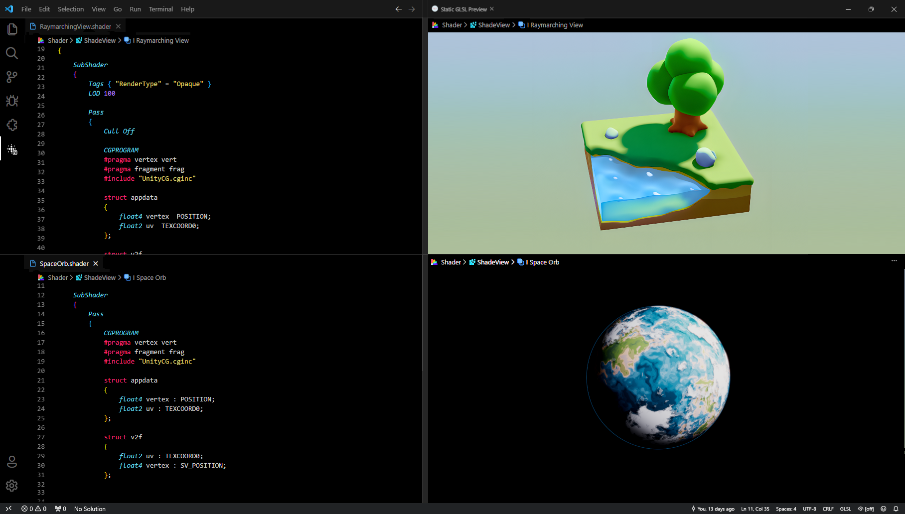
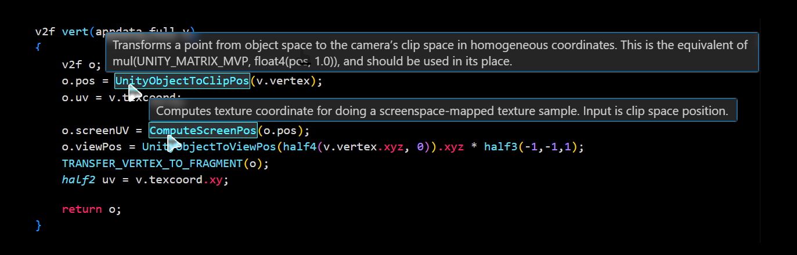

# 🌈 ShadeView 2.0 - Complete Shader Support for Visual Studio Code

[](https://github.com/ovsky/shadeview-2.0/releases/latest)
[](https://github.com/ovsky/shadeview-2.0/tree/extension_only/)
  

---

## ✨ ShadeView 2 - Description

**ShadeView 2** - for _Visual Studio Code_ provides the first-ever comprehensive support for writing **HLSL** (High-Level Shading Language) and **GLSL** (OpenGL Shading Language), along with **ShaderLab** and **Compute Shaders** in the **VSC IDE**. Designed specifically for graphics engineers and developers working with shaders, especially in Unity or Godot - but it also works with every engine you choose!
The plugin enhances your workflow by bringing advanced features for these languages directly into **Visual Studio Code** and/or your favorite **VSC-based** code editor and game engine.


#### 📦 _Marketplace:_ https://marketplace.visualstudio.com/items?itemName=awwsky.shadeview

---

## 🌟 Features



> Shader Realtime Preview Feature [Available in Preview Version - WIP]

---

- **🔍 Syntax Highlighting**:  
  Robust syntax highlighting for HLSL,GLSL and Compute Shaders, making it easier to read and navigate shader code. It highlights language-specific keywords, types, functions, and more.

- **💡 Autocomplete**:  
  Intelligent code completion for HLSL, GLSL and Compute Shaders built right into VSCode. Get suggestions for language constructs and shader functions, reducing time spent on remembering function names and syntax.

- **📜 Code Snippets**:  
  Quickly insert common shader code snippets, such as function templates for vertex and fragment shaders, matrix transformations, or texture sampling, to accelerate shader development.

- **📚 Built-In Shaders Documentation**:  
  Just `hover your mouse over a keyword` and you'll see _exactly what it does_!
  However, if it's an engine method - press `F12` to see the definition or if it is complicated one, right-click and select **Go to Definition** to see clearly how the method works!

- **❗ Error Highlighting**:  
  Real-time error detection and linting for HLSL, GLSL and Compute Shader code, ensuring you catch issues before compilation, with detailed error messages.

- **🔧 Debugging Support**:  
  Integrated debugging features like stepping through code, inspecting variables, and viewing real-time outputs.

- **🌍 Cross-Platform Support**:  
  Fully compatible with both Windows and MacOS for HLSL, GLSL and Compute development, with partial or full support for Linux - depending on which distribution you use.

- **⚙️ Customizable Settings**:  
  Customize the plugin's features to your preferences, including adjusting syntax highlighting, customizing linting rules, or setting up custom code snippets and more.

---

## 🛠️ Work In Progress (WIP)

- **🔮 Shader Realtime Preview - Integrated Multi-Language Feature**:
- Test your shader code directly within Visual Studio Code with an integrated GLSL and HLSL compiler, ensuring your shaders are valid and ready for your graphics pipeline!

---



> Documentation Highlight Preview Feature - Explains Every Function

---

## 🚀 Installation

1. Launch **VSCode**.
2. Go to the Extensions view **(View > Extensions)**.
3. Search for the **"ShadeView 2"**.
4. Install the plugin.
5. Reload VSCode.

> 🎉 Enjoy! :)

## ⚙️ Instructions

### ⚡ Fast Way:

1. Open a shader file.
2. From the VSCode bottom bar, where you may see the "Plain Text" label, select **"ShadeView" or "ShadeLab""** as Language Mode.

### 🛠️ Perfect Way:

1. Open a shader file.
2. Press `CTRL + SHIFT + P` to open the command palette.
3. Select **"Format Document With..."**.
4. Select **"Configure Default Formatter"**.
5. Choose **"ShadeView" or "ShadeLab""** as Language Mode.
6. Done! 🎊

---

## 😸🫂😸 Cooperation

_For me, the best payment for a ton of hard work and a long months of development of a **ShadeView 2** would be just people, wanting to help with its development! Just like with the first version - I'm counting on you, people! :)_

---

**ShadeView 2 - Source Code**: [GitHub Repository: ShadeView 2](https://github.com/ovsky/shadeview-2.0)

---

You **_do NOT NEED to know programming_** in Node/JS/TS or even any shader language, to support the development!

#### DEVELOPERS:

Above all, if youre programmer, you can help by developing translation system HLSL/GLSL (Unity) > Three.JS, which can be found: `.\extensionn\out\src\ShaderRenderer.js`. Alternatively if you are not interested in Unity, you can find your way by adding support for other game engines or frameworks! It is one of my biggest goals for **ShadeView 2** or **3**, to be fully universal. _Eventually, you can suggest better way to render shaders in VSC than clumsy translating code into Three.JS, if you have :)_

  #### SUPPORTERS:

Even _if you do not know much about coding_, or you just do not code in JS/TS, you can help by expanding the shaders documentation JSONs in: `extension\out\src\data`. For example, like finding and adding an any omited by me Shader keyword/function/value/type and entering description of it- _yes it's as simple as it sounds!_ - for example, you can find something in Unity or Vulkan documentation, like - for example - `_WorldSpaceCameraPos` and you can simply add found information, that it is: World-Space relative position of the Camera, represented by `float3` :)

`Example:`

```
"_WorldSpaceCameraPos": {
"type": "float3",
"documentation": "World-Space position of the Camera."
},
```

---

💜😀🩷🫥❤️😈🧡🥶💛

> I would be extremely grateful and any help would be rewarded - maybe not financially, due to the non-profit nature of the project, but by being recognized as one of the co-authors of the **ShadeView 2**!

 _You can reach me by my email:_
przemek.orlowski@outlook.com


> Many people suggested to create ShadeView Development Discord, if you think it is a great idea, please tell me by this archaic, e-mail, way! :)

> Thanks in advance!

 _And since you're here, you can, take a look on my portfolio:_
https://orlowski.works/

> _P.S. complete ShadeView 2 documentation will be available soon™ :)_


---
